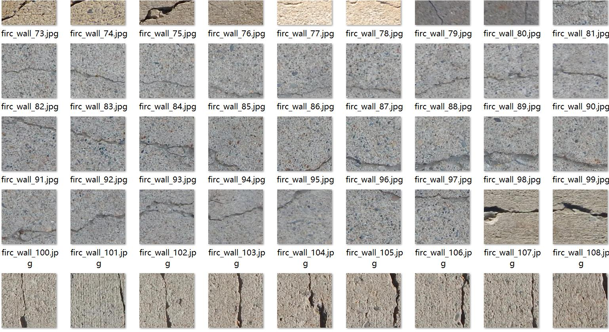
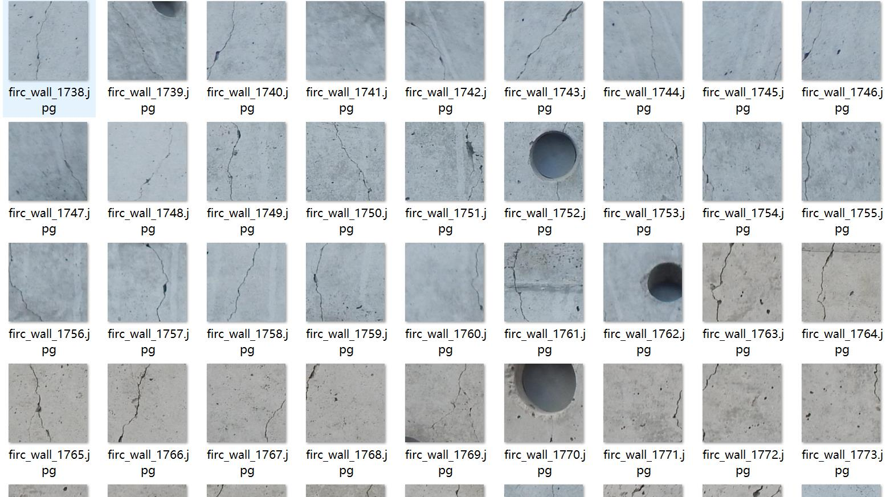
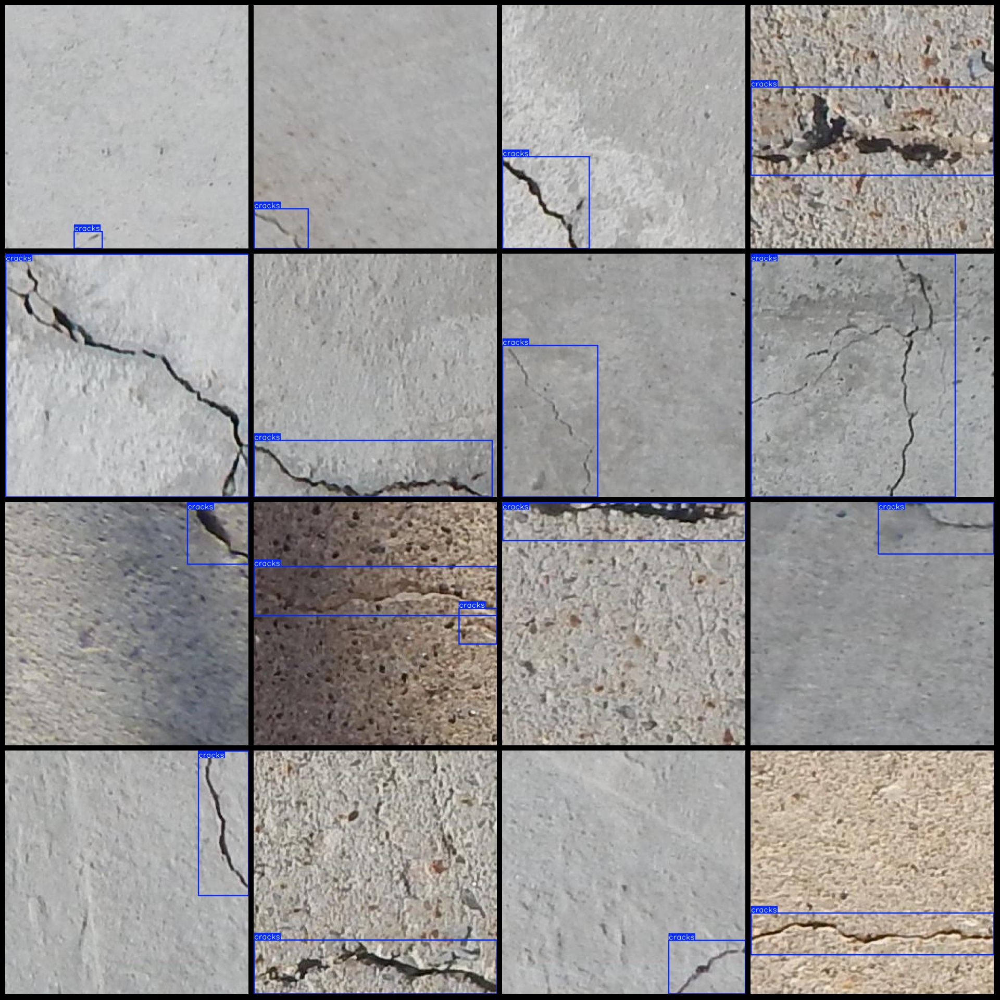
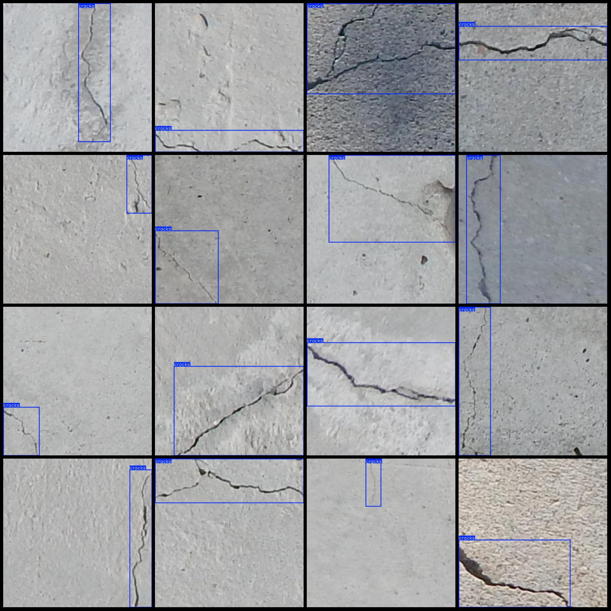

# Building Wall Cracks Detection Dataset in Pascal VOC+YOLO Format with 1 Category

Dataset Format: Pascal VOC format + YOLO format (excluding the split path in the txt file, only containing jpg images along with corresponding VOC format xml files and yolo format txt files).
Number of Images (jpg file count): 1795
Number of Annotations (xml file count): 1795
Number of Annotations (txt file count): 1795
Number of Categories: 1
Category Name: ["cracks"]
Number of Boxes per Category:
cracks = 1907
Total Boxes: 1907
Number of Images per Category:
cracks = 1795
Image Resolution: 640x640
Annotation Tool Used: labelImg
Annotation Rules: Draw rectangular boxes for each category
Important Notice: The dataset does not have a division into training, validation, or test sets; users must divide it themselves.
Special Remark: This dataset does not guarantee the accuracy of the trained model or weight files.
Image Preview:
Annotation Example:

## Images

Here is a pay link on Stripe ( https://buy.stripe.com/3cs8yP7sY87d0vu9AB ). Please contact me lonlonago@foxmail.com after funding $89, and I will send you a complete data files , thank you!

